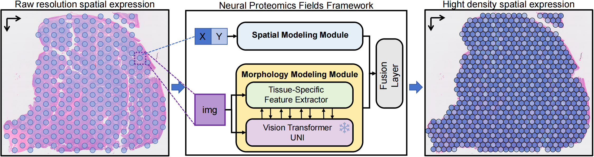

# NPF
Neural Proteomics Fields for Super-resolved Spatial Proteomics Prediction - MICCAI2025

[Arxiv](https://arxiv.org/abs/2508.17389)



## Create conda env
```bash
conda create -n NPF -y python==3.10
git clone https://github.com/Bokai-Zhao/NPF.git
cd NPF
```
Please install PyTorch 2.0.1 or later and the corresponding torchvision:
```bash
# Example installation command:
pip install torch==2.1.0 torchvision==0.16.0 --index-url https://download.pytorch.org/whl/cu118
```
Or select the appropriate command for your environment from the following link:
[PyTorch Previous Versions](https://pytorch.org/get-started/previous-versions/)

```bash
pip install -r requirements.txt
```
install MSDeformAttn

```bash
cd ./src/model/ops
python setup.py build install
# test install
python test.py
```
## Dwonload Data
```bash
cd ./data
bash down-10xVisium.sh
```

```
├── 10xVisium
│   ├── CytAssist_FFPE_Protein_Expression_Human_Tonsil
│   │   ├── filtered_feature_bc_matrix.h5
│   │   ├── spatial
│   │   │   ├── aligned_fiducials.jpg
│   │   │   ├── aligned_tissue_image.jpg
│   │   │   ├── cytassist_image.tiff
│   │   │   ├── detected_tissue_image.jpg
│   │   │   ├── scalefactors_json.json
│   │   │   ├── spatial_enrichment.csv
│   │   │   ├── tissue_hires_image.png
│   │   │   ├── tissue_lowres_image.png
│   │   │   └── tissue_positions.csv
│   │   ├── spatial.tar.gz
│   │   └── tissue_image.tif
│   └── CytAssist_FFPE_Protein_Expression_Human_Tonsil_AddOn
│       ├── filtered_feature_bc_matrix.h5
│       ├── spatial
│       │   ├── aligned_fiducials.jpg
│       │   ├── aligned_tissue_image.jpg
│       │   ├── cytassist_image.tiff
│       │   ├── detected_tissue_image.jpg
│       │   ├── scalefactors_json.json
│       │   ├── spatial_enrichment.csv
│       │   ├── tissue_hires_image.png
│       │   ├── tissue_lowres_image.png
│       │   └── tissue_positions.csv
│       ├── spatial.tar.gz
│       └── tissue_image.btf
└── down-10xVisium.sh
```

## Dwonload Weights
for STNet
```bash
cd weights
bash down.sh
```
for UNI

model link : https://huggingface.co/MahmoodLab/UNI put the weights file `pytorch_model.bin` in the folder `weights/UNI`

## Train

```bash
cd src
python train-NPF.py --seed 42 --Dateset 10xVisium --sample CytAssist_FFPE_Protein_Expression_Human_Tonsil
```
